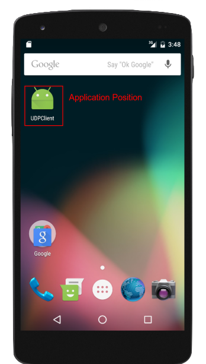

# Final Report

## Introduction

Usage of softwares is increasing every year along with evolving technology.
Software is made for multiple different purposes and require distinctive resources and security measures.
What is common to most software is that it is supposed to work correctly and not have bugs or security breaches.
To ensure correctness, software has to be tested extensively.
With software getting more complex, the more difficult it is to test it.
Alongside the constant evolution of software, new automated testing methods have also been introduced.
In this paper we discuss two state-of-the-art techniques for testing the correctness of software: Fuzzing and State Machine Learning, and apply these techniques on Android applications using a modern testing tool.

The reason why we analyze these two methods is because of a tool that was made less than a year ago at Delft University of Technology.
This tool was developed as a Bachelor project for the IT bank company [bunq](https://www.bunq.com) to test their iOS and Android applications.
The tool is split in two parts, [fuzzer](https://github.com/bunqcom/fuzzer) for fuzzing and [fsm-learner](https://github.com/bunqcom/fsm-learner) for learning finite state machines.
The tool was made specifically for the bunq applications but with some configuration changes it is possible to apply it on any other application.

In this paper we will analyze the fuzzer and fsm-learner tools and apply them on two very different applications.
The progress of using the tool will be described, the results from using it along with alternations to the tool and possible future work.

### Fuzzing

* What is fuzzing and what is its benefits

### State Machines

* What are state machines and what is its benefits

## Tools

* What already existed

### Fuzzing Tool
#### Description
In order to fuzz an android application, we need to be able to emulate random action and input inside an android device and analyze the results. For that reason we use the fuzzing tool described in the introduction. The architecture of the tool consists of two  sub-applications, one android background application, fuzzer-android-server, that runs on the target device and one desktop application, Pc-Client, that sends information to the android app. The communication between these two applications is established through a socket connection for sending data back and forth.

**fuzzer-android-server** : This is a server that runs on the background of the android application. First it starts the socket so it can receive the data, in the form of ActionInstruction objects, from the client. and gets the instructions from client. The information are parsed and interpreted using the `UIAutomator` and specifically function calls of the two android objects `UiObject`, `UiDevice`.

**Pc-client** : The Pc-client is in charge of creating actions e.g. click button or insert input to a text field and send them to the server. It reads XML files parses them to action objects and sends them to the server through the socket. For every action the user can assign a chance value that will determine whether it is executed or not. As a result we can create a set of actions that are executed randomly based on their chances..

In the following figure we have the overview of how the tool works:


#### Problems
In our analysis with the tool, we found some limitations with the existing implementation and added our own functionalities to extend the capabilities of the tool. Below we describe these limitations and what we suggest to improve the tool.  
First of all, an action can be applied only to an element that exists as part of the android `layout.xml`. Modern applications tend to use less and less pre-defined XML elements in their activities and instead dynamically generate them through the code. Elements like `Dialogues` and their "Cancel, OK" buttons or `ActionBarFragment` do not include XML elements for their UI components. As a result the tool in its current state cannot reach all the possible states of an application. Furthermore, the socket communication between the client and server causes a delay when applying the emulated action on the running application. This can limit the fuzzing on the perspective of exhausting memory or network resources. Finally when the fuzzer successfully crashes the running application there doesn't seem to be a clear way to identify this result on the Pc-Client. Because of this problem the fuzzing process we described before cannot be repeated automatically.

#### Additions
For these reasons we decided to extend the tool and add some functionalities that partially solve some of the mentioned problems. Afterwards, we use the new functionalities to automate the fuzzing process.

We added two below function calls inside the `DriveUiAutomator.java` which exposed two new values that can be inserted in the `action` field of the XML.

1. **getClassName** : returns the name of the current package. This value will help us determine whether the application has crashed or the current package is the target application. If the application crashes then the result is the string `android`.

````java
public String getClassName() throws UiObjectNotFoundException {
  String class_name = device.getCurrentPackageName();
  return class_name;
}
    ````
2. **clickSpecific** : It is provided with coordinates in the format of `coordinate_X,coordinate_Y` and emulates a click on that position. The return string informs us if the action was successful or not.

````java
public String clickSpecific(String id) throws UiObjectNotFoundException{
  String[] splitCoordinates = id.split(",");
  Integer x = Integer.parseInt(splitCoordinates[0]);
  Integer y = Integer.parseInt(splitCoordinates[1]);
  if (device.click(x,y)) return "successful click";
  else return "problem with click";
}

````
Based on these two new functionalities, we introduced a XML template file with actions that automate the process of fuzzing any android application. For the template, the user needs to put the target application on the top left corner of the android virtual device and the devices size should be that of a normal  phone and not tablet. The action set consists of three sub action sets that are the three steps in the fuzzing process which we can see below:


1. The first action clicks on the coordinates on the top left corner of the android device where we have placed the target application. Also we get the string that shows the current package name to verify that we are inside the application. (**FIRST FIGURE REF**)

2. This set of action can be defined by the user and is different for every application. Based on the XML elements of every application any combination of actions can be inserted here.

3. Finally there are two different possibilities of the outcome of our fuzzing. Either the application did not crash and we are still inside the application. For that reason, we first get the current package name and then perform actions without knowing if the application crashed or not. If it did not crash we  emulate the back action to the device to exit the application. This action is sent  5 times but this number depends on the target application and the activity depth it has. If it has crashed the first back actions will be ignored and we need to emulate a click on the default crash message by android. After that, we emulate again the same back actions. (**SECOND FIGURE REF**)




At the end of the fuzzing process, the user can analyze the output and compare the results of the `getClassName` calls. If the application crashed with a specific set of actions then the result of `getClassName` will be `android`. Therefore, the set of actions  between the two calls of `getClassName` with the second call having `android` as a result is the set of actions that crashed the application.

### fsm-learner

* What is does, its capabilities
* How it's implemented (short)

### Plan

* What we do with the tool

## Sage Math

* About Sage

### Sage Fuzzing

### Sage State Machine

### Discussions (maybe)
* Summerize what we were able to do and what not

## UDPClient

* About the app

### UDPClient Fuzzing

### UDPClient State Machine

### Discussions (maybe)
* Summerize what we were able to do and what not

## Future Work

## Conclusion
