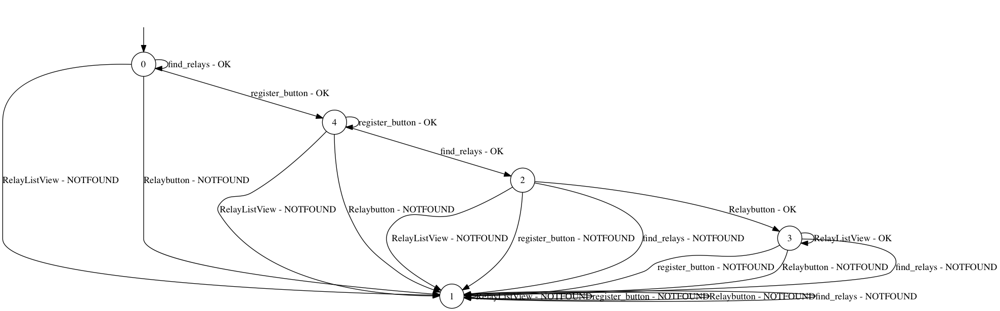
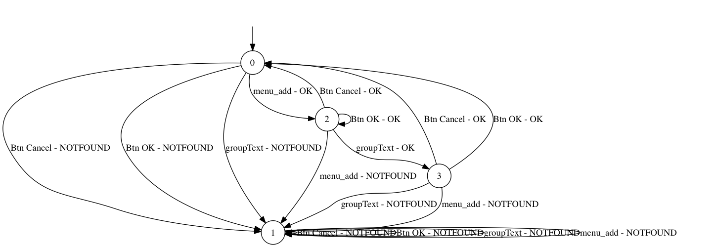

# Final Report

## Introduction

Usage of softwares is increasing every year along with evolving technology.
Software is made for multiple different purposes and require distinctive resources and security measures.
What is common to most software is that it is supposed to work correctly and not have bugs or security breaches.
To ensure correctness, software has to be tested extensively.
With software getting more complex, the more difficult it is to test it.
Alongside the constant evolution of software, new automated testing methods have also been introduced.
In this paper we discuss two state-of-the-art techniques for testing the correctness of software: Fuzzing and State Machine Learning, and apply these techniques on Android applications using a modern testing tool.

The reason why we analyze these two methods is because of a tool that was made less than a year ago at Delft University of Technology.
This tool was developed as a Bachelor project for the IT bank company [bunq](https://www.bunq.com) to test their iOS and Android applications.
The tool is split in two parts, [fuzzer](https://github.com/bunqcom/fuzzer) for fuzzing and [fsm-learner](https://github.com/bunqcom/fsm-learner) for learning finite state machines.
The tool was made specifically for the bunq applications but with some configuration changes it is possible to apply it on any other application.

In this paper we will analyze the fuzzer and fsm-learner tools and apply them on two very different applications.
The progress of using the tool will be described, the results from using it along with alternations to the tool and possible future work.

### Fuzzing

As already thoroughly explained in our summary [**REF TO SUMMARY**] the purpose of fuzzing is to test boundary conditions in an automated way.
The main idea is that boundary conditions are the most relevant to check since they can cause an elevation of privilege.
However this is not always the case.
Sometimes fuzzing is used merely to check for crashes on the application in an automated way in order to fix them without having the burden of manually generating test cases.
The concept behind it remains the same, the difference resides in the purpose.


### State Machines

Finite State Machines (FSM) can be used to examine and test software implementations.
Analyzing FSM's can provide information about possible bugs and deadlocks and can show if all possible paths in the software are correct and secure [REFERENCE SLIDES].
It could happen that transitions or states are identified that are not supposed to be there or when entering a certain state, it is not possible to get to another state from there.... NOT FINISHED

## Tools

* What already existed

### Fuzzing Tool
#### Description
In order to fuzz an android application, we need to be able to emulate random action, insert input into the android device and analyze the results. For that reason we use the fuzzing tool described in the introduction. The architecture of the tool consists of two  sub-applications, one android background application called fuzzer-android-server that runs on the target device and one desktop application called Pc-Client that sends information to the android application. The communication between these two applications is established through a socket connection for sending data back and forth.

**fuzzer-android-server** : This is a server that runs on the background of the android application. First it starts the socket so it can receive the data, in the form of ActionInstruction objects and then waits for the incoming data. The information are parsed and interpreted using the `UIAutomator`. The `UIAutomator` is a UI testing framework that provides a set of APIs in order to provide interaction with a user app. Specifically the implemented functionalities utilize the API calls of the two android objects `UiObject` and  `UiDevice`.

**Pc-client** : The Pc-client is in charge of creating actions e.g. click button or insert input to a text field and send them to the server. The user can create an XML file and insert the actions he wants to emulate with a specific format. The chance of an action being picked and sent to the server can be specific as well as the order of the actions. Once the XML file is parsed, actions are translated into action objects and sent  to the server through the socket.

For our fuzzing implementation, we used a file with various values as input. The input stretched form text strings of various sizes to numbers and special characters.

In the following figure we have the overview of how the tool works:


#### Working with the tool
In our analysis with the tool, we found some limitations with the existing implementation and added our own functionalities to extend the capabilities of the tool. Below we describe these limitations and what we suggest to improve the tool.  
First of all, an action can be applied only to an element that exists as part of the android `layout.xml`. Modern applications tend to use less and less pre-defined XML elements in their activities and instead dynamically generate them through the code. Elements like `Dialogues` and their  buttons or `ActionBarFragment` do not include XML elements for their UI components. As a result the tool in its current state cannot reach all the possible states of an application. Furthermore, the socket communication between the client and server causes a delay when applying the emulated action on the running application. This can limit the fuzzing on the perspective of exhausting memory or network resources. Finally when the fuzzer successfully crashes the running application there doesn't seem to be a clear way to identify this result on the Pc-Client. Because of this problem the fuzzing process we described before cannot be repeated automatically.

#### Additions
For the aforementioned reasons we decided to extend the tool and add some functionalities that partially solve some of the mentioned problems. Afterwards, we use the new functionalities to automate the fuzzing process.

We added two  function calls inside the `DriveUiAutomator.java` which exposed two new values that can be inserted in the `action` field of the XML.

1. **getClassName** : returns the name of the current package. This value will help us determine whether the application has crashed or the current package is the target application. If the application crashes then the result is the string _android_.

  ````java
  public String getClassName() throws UiObjectNotFoundException {
    String class_name = device.getCurrentPackageName();
    return class_name;
  }
  ````

2. **clickSpecific** : Provided with coordinates in the format of `coordinate_X,coordinate_Y` this function emulates a click on that position. The return string informs  if the action was successful or not.

  ````java
  public String clickSpecific(String id) throws UiObjectNotFoundException{
    String[] splitCoordinates = id.split(",");
    Integer x = Integer.parseInt(splitCoordinates[0]);
    Integer y = Integer.parseInt(splitCoordinates[1]);
    if (device.click(x,y)) return "successful click";
    else return "problem with click";
  }
  ````
  In order to find the X,Y coordinates on an android application we created and added to each android  `Activity` the following code fragment. Whenever a user clicks on the screen the coordinates are logged.
  ````java
  @Override
  public boolean onTouchEvent(MotionEvent event) {
      int x = (int)event.getX();
      int y = (int)event.getY();
      switch (event.getAction()) {
          case MotionEvent.ACTION_MOVE:
              Log.i("coordinates","X:"+x+"   Y:"+y);

      }
      return false;
  }
  ````

Based on these two new functionalities, we introduced a XML template file with actions that automate the process of fuzzing any android application. For the template, the user needs to put the target application on the top left corner (**FIRST FIGURE REF**) of the android virtual device and the devices size should be that of a normal  phone and not tablet. The action set consists of three sub action sets that are the three steps in the fuzzing process which we can see below:


1. The first action clicks on the coordinates on the top left corner of the android device where we have placed the target application. Also we get the string that shows the current package name to verify that we are inside the application. (**FIRST FIGURE REF**)

2. This set of action can be defined by the user and is different for every application. Based on the XML elements of every application any combination of actions can be inserted here. Essentially, this is where the fuzzing is implemented.

3. Finally there are two different possibilities of the outcome of our fuzzing. Either the application did not crash and we are still inside the application or the application crashed and we need to restart it. For that reason, we first get the current package name and then perform actions without knowing if the application crashed or not. If it did not crash we  emulate the back action on the device to exit the application. This action is sent  5 times but this number depends on the target application and the activity depth it has. If it has crashed the first back actions will be ignored and we need to emulate a click on the default crash message by android. After that, we emulate again the same back actions. (**SECOND FIGURE REF**)

4. At the end of the fuzzing process, the user can analyze the output and compare the results of the `getClassName` calls. If the application crashed with a specific set of actions then the result of `getClassName` will be `android`. Therefore, the set of actions  between the two calls of `getClassName` with the second call having `android` as a result is the set of actions that crashed the application.


### fsm-learner

The purpose of this tool is this of translating an application into a finite state machine.  
A finite state automaton can be represented by the quintuple `(𝚺, S, S0, 𝛅, F)`.  
* **𝚺** is the alphabet that the FSM accepts.
This considered in the case of an android application is the list of possible actions available in every specific screen of the application (`EditText`,`CheckBox`, `Button`, etc.).
* **S** represents a set of states which needs to be _finite_ and _non-empty_.
* **S<sub>0</sub>** is the start state of the application
* **𝛅** is the transition function (`S x 𝚺 -> S`).
This represent the transition from one state to the other accepting a specific element of the alphabet.
* **F** is a finite set of final states (`F ⊆ S`). This can be empty if the system doesn't have any final state.

In order to retrieve a finite state machine from the application all the elements of this quintuple needs to be defined. And this is performed in 2 main steps.

##### Defining the alphabet 𝚺
The alphabet is retrieved dumping the screens of the application.
Every screen contains UI elements that allow different actions.
For this reason the `adb shell uiautomator dump` functionality is used.
Using this command an XML file containing a dump of the screen is obtained and from this file all the possible actions are extracted and put into the alphabet.
The words in the alphabet have the following structure:  
```
action%param1#param2#...#paramx
```
The % separates the action from the parameters and the # separates the parameters.
The actions available are `push`, `chekc` and `enterText`.
One of these three actions combined with the parameters that represent the xPath of the specific component creates a word for the alphabet.
An example of such a word is:  
```
push%//android.widget.FrameLayout[1][@index='0' and @resource-id='' and contains(@text, '') and @content-desc='']/android.widget.ListView[1][@index='0' and @resource-id='' and contains(@text, '') and @content-desc='']#125#65
```  

This represents the action of pushing an element contained in a `ListView`.  
The tool provide two functionalities for the purpose of generating this alphabet:
1. The first one `alphabet:create` helps the user dumping the screens of the application.
2. The second one `alphabet:compose` merge all the actions obtained from the screen dumps and compose the alphabet of the finite state machine.

##### Defining the states
After defining the alphabet **𝚺** the learning process starts.
The tool is split in 2 parts:
* **Teacher:** The teacher executes the action that is instructed to perform.
These actions are sent to the device using [appium](http://appium.io) which makes possible to perform automated application on the device.
* **Learner:** The learner executes the learning algorithm trying to create the state machine.
It is in charge of providing the teacher with the action that wants to execute.
After the action is executed the learner stores the result provided  by the teacher to refine its knowledge about the system.
These answers can be `0-OK` or `1-NOTFOUND` depending on the fact that the system is able to perform or not such an action from that specific condition.
When it considers to have an accurate representation of the system under learning (_SUL_) tries to test this representation sending the generated state machine to the teacher so that it can test it with different _counterexamples_.
If the tests succeed the learning procedure stops and provides the user with a `dot` graph of the system. Otherwise it starts a new learning round improved with what went wrong in the last round.

Afterwards, when the automata is generated it contains the different states that depict the system along with a sink state where all the action that are not accepted from a state (all those marked as `1-NOTFOUND`) go.

#### Reset
The bunq tool offers possibilities to restart the execution of actions after executing some specified actions.
This can be done in three possible ways: hard reset, soft reset and semi-soft reset.
The hard reset completely restarts the application while the soft reset serves more like a back button functionality, bringing the application back to the overview screen.
The specific actions are specified in the config file, represented with the words from the alphabet.
Before each new query it is checked if a reset should occur, which will happen if the last successfully executed action was specified in the config.
This was most likely implemented so that when reaching a final state, where it is not possible to go to any new state, it would be possible to continue the exploration.
This way it is possible to not include the back buttons in the state machines, which would otherwise make them much more complicated.

#### Working with the tool

It was not without trouble to get the tool working correctly.
In the early stages we had troubles with running the tool without errors and then to make it work correctly for our application.

Firstly, there was a script missing from the repository on GitHub that was necessary to create the alphabet from the UI screen dumps.
Luckily, we could contact the developers of the tool and get the missing script.
We tried to use the previously described method `alphabet:create` to create the alphabet but there were errors in the code that we were not able to fix.
Instead we bypasses that method and used a script of theirs to manually create the alphabet.
In this process we also had troubles with interactions with Appium.
There had been some changes in the Appium code after the publication of the tool so we had to update the code to match those changes [[1](#type-change)].

When we got the tool running, we then had to make the tool work correctly with our application.
Besides changing the config to reference our application, we had to modify some parts of the code, such as disabling login that was performed for the bunq app.
The problem that required the most effort was making the reset implementation work correctly.
Like stated before, the reset was only performed after executing some specified actions.
After discussing this in the lab with the teachers of the course, we thought that this implementation should be changed so that it would always reset before each new query using hard reset.
After doing those changes in the code, we also had to change how the tool restarted the application since the previous implementation gave errors.
To open and close the application, methods from Appium were used that threw exceptions.
Instead we modified the code so it wouldn't call Appium to perform this but instead execute at runtime an adb instruction.

Finally, we had studied fuzzing extensively by investing a lot of time into studying papers about the subject.
It was decided much later to also create a FSM for an application but not only to fuzz it.
We had therefore much less knowledge about the subject which slowed the process significantly.


## Applications used

After getting these tools to work we could finally apply them on two Android applications.
In the time of starting this project, we did not have any application that we had wrote that fitted nicely for this tool (e.g. had non-xml layout).
We therefore looked for Open Source Android applications that might be interesting to apply these tools on.
We found the SageMath application which is a mathematics software to calculate and plot graphs from given input [[2](#sagemath-github)].
Later on in the project, one of the team members had finished work on another course (Hacking Lab) where he created an application for peer to peer communication, called UDPClient.
We thought it would be very interesting to also apply the tool on our own written code.
Also, after having had some trouble with using the SageMath application, we hoped that it would be
These two applications and the process of applying the tools on them will be described in the next sections.

## UDPClient

The UDPClient application is part of the Hacking Lab course assignment of one of our team members. This application is used for peer to peer communication between devices that have the application installed. Every peer first registers to a server and then retrieves information about other registered peers. With the use of the new added functionalities on the fuzzing tool we tried to fuzz it.

### UDPClient Fuzzing
The application does not include many fuzzing points from the perspective that the user cannot insert many different inputs. However, the network architecture of the application exposes different cases where connection variables could have not be initiated properly. Therefore, in our action XML file we included random click actions of buttons with a random chance as well as various text inputs. After running the fuzzing tool for a few hours, we discovered two weak points that caused the application to crash.

1. If a user tried to get the list of registered peers without having first connected to the server, the application did not handle correctly the `null` reference and crashed. The existing code did the following check
  ````java
  if ( !(MyRouter == null) && MyRouter.registered)
  ````
  However, the second condition was also evaluated even though the `MyRouter` variable was null. This caused the application to crash. (**FIRST FIGURE REF**)

2. The second weak point that was discovered with the fuzzing tool was a set of actions that ignored some UI elements that are preventing actual users from performing actions. While the application is retrieving from the server the list of users there is a `ProgessDialog` to prevent the user from clicking something. Normally users do not ignore this message but the fuzzing tool kept emulating actions. When a click on the `See Relays` button was emulated but the server had not responded yet with the actual list this caused a `null` reference and crashed the application. In the following picture we can see the `ProgressDialog` and the `See Relays` button in the background. (**SECONG FIGURE REF**)

3. The available text input for a user are two text fields that correspond to a server IP and Port. After fuzzing with random inputs there was no successful input that crashed this application. As a result from the perspective of text fuzzing, there are no weak points.


 

### UDPClient State Machine

As mentioned before the first thing to do is creating the alphabet.
After dumping all the 3 screens of the application `alphabet:compose` has been used to retrieve the alphabet.
This was composed by 11 words:

**☐** enterText% AddressText  
**☐** enterText% PortText  
**☑︎** push% register_button  
**☑︎** push% find_relays  
**☐** check% checkBox  
**☐** push% spinnerSource  
**☐** push% spinnerTarget  
**☐** push% ListView[1]\_1  
**☐** push% ListView[1]\_2  
**☑︎** push% RelayButton  
**☑︎** push% RelayListView  

The checked ones are the one that has been included in the final version of the alphabet to build the FSM.
Deciding not to include all the words of the original alphabet into the final one was a a forced choice.
In fact, we let the learner run for many hours with the complete alphabet without any result.
The main problems were the speed of appium and the computational power of the laptop on which we were running the experiment.
All the simulations have been run on the android emulator.
Running the complete system on a single machine was slowing down significantly the performances of the laptop taking a lot of time for the emulator to perform the actions (many time the emulator got stuck for several minutes before starting again).
Summing this problem with the slow speed of appium's communication after a whole night running the learner didn't even try a counterexample.
Therefore we decided to shrink down the alphabet to the most meaningful words in term of state of the system.
Otherwise it would have required too much time in order to being able to obtain a state machine with the full alphabet.
These words are the one checked on the list above.


The following state machine that was created represents correctly the behavior of the UDPClient application.  
* _State 0_ represents the first  screen of the aplication. The possible actions on this screen are either the 'Connect/Register to Server' or 'Find Relays' button. If the latter is pressed then the user cannot proceed since he first needs to connect to the server. We can see this behavior with the find_relays arrow that stays at _State 0_. On the other hand if the user clicks the first button he moves to _State 4_.
* _State 1_ represents the state where all actions arrive if the corresponding alphabet element is not found.
* _State 2_ represents the state where the user can only press the Relaybutton which as we can see leads to another state.
* _State 3_ represents the final screen of the application. In this case the only part of the alphabet that is available is the RelayListView which when clicked remains in the same page. As we can see in the state machine this is represented correctly with the arrow that leads back to _State 3_.
*  _State 4_ represents again the first screen but this time the user has registered. From that state if the user clicks the register button again he stays in the same state. If he presses the Find Relays button he can now proceed to _State 2_.



As can be seen from the state machine we chose to keep just these words since they were the only ones responsible of meaningful transitions.
All the others would have resulted just in loops on the same state.
We decided to add one of these loops as a proof of concept adding the `RelayListView` that starts and ends in _S<sub>3</sub>_, but keeping all of them would have been a barrier in producing the final automaton.

Another big obstacle that we encountered while working with the state machine learner was the reset of the application.
We explained earlier that the initial version of the tool wasn't performing any kind of reset of the application returning meaningless state machines.
In [**FIGURE REF**] we have a simplified example of a state machine generated without resetting the application before each query.
We removed useless transitions from the dot file to make the graph smaller and more readable but the significant part of the graph is still there.
As can be observed comparing the graph in [**FIGURE REF PROPER GRAPH**] and the one in [**FIGURE REF**] the transitions in the latter have no logical connections.
The learner believed that it was possible to reach the `spinnerTarget` from _S<sub>0</sub>_ when this is not even in the first page of the application.
After interpreting this graph we realized that we had a problem with the tool and digging into the code we figured out that we needed to set up the reset conditions for which the application had to be restarted.
At the beginning we erroneously set the reset condition just when the system was reaching the final page and clicking on the the `RelayListView`.
Then, as explained before, we fixed this error and the one connected with the restart process after talking with the teachers.


### Discussions (maybe)
* Summerize what we were able to do and what not

## SageMath

SageMath is a free open-source mathematics software system licensed under the GPL [[3](#sagemath)]. It builds on top of many existing open-source packages: NumPy, SciPy, matplotlib, Sympy, Maxima, GAP, FLINT, R and many more. Moreover, SageMath won the  first prize in the scientific software division of Les Trophées du Libre, an international competition for free software in 2007. In 2012 it was one of the projects selected for the Google Summer of Code. These reasons led us to choose this application and try to fuzz it.

### SageMath Fuzzing
With the SageMath application we stumbled upon problems while using the fuzzing tool, as we mentioned before. After analyzing the applications architecture and implementation, we discovered some weak points that could be exploited with fuzzing.

1. The application communicated with a server to send the math equations that were gonna be executed and received the results. This connection was re-established every time with the click of one button.(**REF FIGURE 1**) Therefore, we tried to exhaust the application resources for network capacity and crash it. Although we succeeded when we were manually performing the clicks, with the use of the fuzzing tool the click emulation was too slow to be successful.
2. The application was using a SQLite database to store strings that were inserted by the user. The problem in this case was that SageMath was using a `Dialogue` layout to insert the new user string. Therefore, the `OK` button could not be retrieved through the XML layout file.   We used the fuzzing tool to insert random input into the field and then called  the `clickSpecific` function for the `OK` button. After various text inputs, the application crashed when a large text was inserted. This occurred because the text was not inserted into the database cause of its size. As a result the reference towards that text was `null` and led to the applications crash when the application tried to display it
3. One extra functionality of the application was to let the user insert any code he wanted which was executed from the server. The weak point in this case was specific input that caused the server to answer with a `null`. When this occurred the android application crashed during the parsing of the `null` object with the `Gson` library. We believe that although we discovered this kind of weakness, it is not part of the fuzzing process since the input has to be specifically defined but it is worth mentioning.


  
<a name="Figure10"></a>Figure 10: Create new group

### Sage State Machine

The SageMath application is rather large with complex functionality.
It is not feasible to try to make a state machine for the whole application because of the time it would take.
It is however interesting to see a state machine for one of the cases we discussed when fuzzing the application.
As previously said, we discovered that the application would crash if given a specific input for a name when creating a group.
We therefore chose this procecure to create an FSM, when a user tries to create a new group with a name like shown in [Figure 10](#Figure10).
The user presses the + on the menu and then he can enter a text, press Cancel or press OK.
The alphabet therefore was made out of the following (shortened) words:
* push%button1 (OK)
* push%button2 (Cancel)
* enterText%groupText
* push%menu_add

The following figure shows the corresponding FSM ([Figure 11](#Figure11)):

  
<a name="Figure11"></a>Figure 11: SageMath FSM

* **State 0**: The original state of the application in the first screen.
Here the only possible action from the alphabet is to press the menu_add button.
* **State 1**: All NOTFOUND actions will lead to this state.
* **State 2**: After pressing the menu_add button this state is reached.
From here the popup is visible and it is possible to enter the groupText or press either of the two buttons, OK or Cancel.
Pressing Cancel will close the popup and lead back to state 0.
Pressing OK without having any text entered will not do anything since it is now allowed to create a new group with empty text.
* **State 3**: Entering text will lead to a new state since now pressing OK has different consequences.
Like before, pressing Cancel will close the popup and return to state 0.
Now, pressing OK will create a new group with the name entered in the text field and then close the popup and return to state 0.

This state machine is an accurate description of what happens if these actions are performed in the application.
In this small example, there don't seem to be any mysterious states or any unwanted transitions.

### Discussions (maybe) (I say we include the discussion in each section of the app)
* Summerize what we were able to do and what not

## Future Work / Conclusion
After extending the implemented tools, we had an automated process to fuzz android applications with random inputs and random actions on its elements. Using this we were able to successfully fuzz two applications and gain better insight about them. Moreover, the type of fuzzing cases varied from text input to random click actions.

## References

1. <div id="type-change"/> Appium issue for data type change, https://github.com/appium/appium/issues/6214
2. <div id="sagemath-github"/> SageMath on GitHub, https://github.com/sagemath/android
3. <div id="sagemath"/> SageMath official site,  http://www.sagemath.org/
