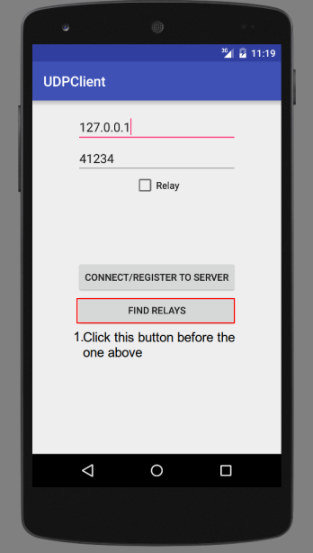

# Final Report

## Introduction

Usage of softwares is increasing every year along with evolving technology.
Software is made for multiple different purposes and require distinctive resources and security measures.
What is common to most software is that it is supposed to work correctly and not have bugs or security breaches.
To ensure correctness, software has to be tested extensively.
With software getting more complex, the more difficult it is to test it.
Alongside the constant evolution of software, new automated testing methods have also been introduced.
In this paper we discuss two state-of-the-art techniques for testing the correctness of software: Fuzzing and State Machine Learning, and apply these techniques on Android applications using a modern testing tool.

The reason why we analyze these two methods is because of a tool that was made less than a year ago at Delft University of Technology.
This tool was developed as a Bachelor project for the IT bank company [bunq](https://www.bunq.com) to test their iOS and Android applications.
The tool is split in two parts, [fuzzer](https://github.com/bunqcom/fuzzer) for fuzzing and [fsm-learner](https://github.com/bunqcom/fsm-learner) for learning finite state machines.
The tool was made specifically for the bunq applications but with some configuration changes it is possible to apply it on any other application.

In this paper we will analyze the fuzzer and fsm-learner tools and apply them on two very different applications.
The progress of using the tool will be described, the results from using it along with alternations to the tool and possible future work.

### Fuzzing

* What is fuzzing and what is its benefits

### State Machines

* What are state machines and what is its benefits

## Tools

* What already existed

### Fuzzing Tool
#### Description
In order to fuzz an android application, we need to be able to emulate random action, insert input into the android device and analyze the results. For that reason we use the fuzzing tool described in the introduction. The architecture of the tool consists of two  sub-applications, one android background application called fuzzer-android-server that runs on the target device and one desktop application called Pc-Client that sends information to the android application. The communication between these two applications is established through a socket connection for sending data back and forth.

**fuzzer-android-server** : This is a server that runs on the background of the android application. First it starts the socket so it can receive the data, in the form of ActionInstruction objects and then waits for the incoming data. The information are parsed and interpreted using the `UIAutomator`. The `UIAutomator` is a UI testing framework that provides a set of APIs in order to provide interaction with a user app. Specifically the implemented functionalities utilize the API calls of the two android objects `UiObject` and  `UiDevice`.

**Pc-client** : The Pc-client is in charge of creating actions e.g. click button or insert input to a text field and send them to the server. The user can create an XML file and insert the actions he wants to emulate with a specific format. The chance of an action being picked and sent to the server can be specific as well as the order of the actions. Once the XML file is parsed, actions are translated into action objects and sent  to the server through the socket.

For our fuzzing implementation, we used a file with various values as input. The input stretched form text strings of various sizes to numbers and special characters.

In the following figure we have the overview of how the tool works:


#### Problems
In our analysis with the tool, we found some limitations with the existing implementation and added our own functionalities to extend the capabilities of the tool. Below we describe these limitations and what we suggest to improve the tool.  
First of all, an action can be applied only to an element that exists as part of the android `layout.xml`. Modern applications tend to use less and less pre-defined XML elements in their activities and instead dynamically generate them through the code. Elements like `Dialogues` and their  buttons or `ActionBarFragment` do not include XML elements for their UI components. As a result the tool in its current state cannot reach all the possible states of an application. Furthermore, the socket communication between the client and server causes a delay when applying the emulated action on the running application. This can limit the fuzzing on the perspective of exhausting memory or network resources. Finally when the fuzzer successfully crashes the running application there doesn't seem to be a clear way to identify this result on the Pc-Client. Because of this problem the fuzzing process we described before cannot be repeated automatically.

#### Additions
For the aforementioned reasons we decided to extend the tool and add some functionalities that partially solve some of the mentioned problems. Afterwards, we use the new functionalities to automate the fuzzing process.

We added two  function calls inside the `DriveUiAutomator.java` which exposed two new values that can be inserted in the `action` field of the XML.

1. **getClassName** : returns the name of the current package. This value will help us determine whether the application has crashed or the current package is the target application. If the application crashes then the result is the string _android_.

  ````java
  public String getClassName() throws UiObjectNotFoundException {
    String class_name = device.getCurrentPackageName();
    return class_name;
  }
  ````

2. **clickSpecific** : Provided with coordinates in the format of `coordinate_X,coordinate_Y` this function emulates a click on that position. The return string informs  if the action was successful or not.

  ````java
  public String clickSpecific(String id) throws UiObjectNotFoundException{
    String[] splitCoordinates = id.split(",");
    Integer x = Integer.parseInt(splitCoordinates[0]);
    Integer y = Integer.parseInt(splitCoordinates[1]);
    if (device.click(x,y)) return "successful click";
    else return "problem with click";
  }
  ````
  In order to find the X,Y coordinates on an android application we created and added to each android  `Activity` the following code fragment. Whenever a user clicks on the screen the coordinates are logged.
  ````java
  @Override
  public boolean onTouchEvent(MotionEvent event) {
      int x = (int)event.getX();
      int y = (int)event.getY();
      switch (event.getAction()) {
          case MotionEvent.ACTION_MOVE:
              Log.i("coordinates","X:"+x+"   Y:"+y);

      }
      return false;
  }
  ````

Based on these two new functionalities, we introduced a XML template file with actions that automate the process of fuzzing any android application. For the template, the user needs to put the target application on the top left corner (**FIRST FIGURE REF**) of the android virtual device and the devices size should be that of a normal  phone and not tablet. The action set consists of three sub action sets that are the three steps in the fuzzing process which we can see below:


1. The first action clicks on the coordinates on the top left corner of the android device where we have placed the target application. Also we get the string that shows the current package name to verify that we are inside the application. (**FIRST FIGURE REF**)

2. This set of action can be defined by the user and is different for every application. Based on the XML elements of every application any combination of actions can be inserted here. Essentially, this is where the fuzzing is implemented.

3. Finally there are two different possibilities of the outcome of our fuzzing. Either the application did not crash and we are still inside the application or the application crashed and we need to restart it. For that reason, we first get the current package name and then perform actions without knowing if the application crashed or not. If it did not crash we  emulate the back action on the device to exit the application. This action is sent  5 times but this number depends on the target application and the activity depth it has. If it has crashed the first back actions will be ignored and we need to emulate a click on the default crash message by android. After that, we emulate again the same back actions. (**SECOND FIGURE REF**)

4. At the end of the fuzzing process, the user can analyze the output and compare the results of the `getClassName` calls. If the application crashed with a specific set of actions then the result of `getClassName` will be `android`. Therefore, the set of actions  between the two calls of `getClassName` with the second call having `android` as a result is the set of actions that crashed the application.


### fsm-learner

* What is does, its capabilities
* How it's implemented (short)

### Plan

* What we do with the tool

## SageMath

SageMath is a free open-source mathematics software system licensed under the GPL. It builds on top of many existing open-source packages: NumPy, SciPy, matplotlib, Sympy, Maxima, GAP, FLINT, R and many more. Moreover, SageMath won the  first prize in the scientific software division of Les Trophées du Libre, an international competition for free software in 2007. In 2012 it was one of the projects selected for the Google Summer of Code. These reasons led us to choose this application and try to fuzz it.

### SageMath Fuzzing
With the SageMath application we stumbled upon problems while using the fuzzing tool, as we mentioned before. After analyzing the applications architecture and implementation, we discovered some weak points that could be exploited with fuzzing.

1. The application communicated with a server to send the math equations that were gonna be executed and received the results. This connection was re-established every time with the click of one button.(**REF FIGURE 1**) Therefore, we tried to exhaust the application resources for network capacity and crash it. Although we succeeded when we were manually performing the clicks, with the use of the fuzzing tool the click emulation was too slow to be successful.
2. The application was using a SQLite database to store strings that were inserted by the user. The problem in this case was that SageMath was using a `Dialogue` layout to insert the new user string. Therefore, the `OK` button could not be retrieved through the XML layout file.   We used the fuzzing tool to insert random input into the field and then called  the `clickSpecific` function for the `OK` button. After various text inputs, the application crashed when a large text was inserted. This occurred because the text was not inserted into the database cause of its size. As a result the reference towards that text was `null` and led to the applications crash when the application tried to display it
3. One extra functionality of the application was to let the user insert any code he wanted which was executed from the server. The weak point in this case was specific input that caused the server to answer with a `null`. When this occurred the android application crashed during the parsing of the `null` object with the `Gson` library. We believe that although we discovered this kind of weakness, it is not part of the fuzzing process since the input has to be specifically defined but it is worth mentioning.


### Sage State Machine

### Discussions (maybe) (I say we include the discussion in each section of the app)
* Summerize what we were able to do and what not

## UDPClient

The UDPClient application is part of the Hacking Lab course assignment of one of our team members. This application is used for peer to peer communication between devices that have the application installed. Every peer first registers to a server and then retrieves information about other registered peers. With the use of the new added functionalities on the fuzzing tool we tried to fuzz it.

### UDPClient Fuzzing
The application does not include many fuzzing points from the perspective that the user cannot insert many different inputs. However, the network architecture of the application exposes different cases where connection variables could have not be initiated properly. Therefore, in our action XML file we included random click actions of buttons with a random chance as well as various text inputs. After running the fuzzing tool for a few hours, we discovered two weak points that caused the application to crash.

1. If a user tried to get the list of registered peers without having first connected to the server, the application did not handle correctly the `null` reference and crashed. The existing code did the following check
````java
if ( !(MyRouter == null) && MyRouter.registered)
````
However, the second condition was also evaluated even though the `MyRouter` variable was null. This caused the application to crash. (**FIRST FIGURE REF**)
2. The second weak point that was discovered with the fuzzing tool was a set of actions that ignored some UI elements that are preventing actual users from performing actions. While the application is retrieving from the server the list of users there is a `ProgessDialog` to prevent the user from clicking something. Normally users do not ignore this message but the fuzzing tool kept emulating actions. When a click on the `See Relays` button was emulated but the server had not responded yet with the actual list this caused a `null` reference and crashed the application. In the following picture we can see the `ProgressDialog` and the `See Relays` button in the background. (**SECONG FIGURE REF**)

3. The available text input for a user are two text fields that correspond to a server IP and Port. After fuzzing with random inputs there was no successful input that crashed this application. As a result from the perspective of text fuzzing, there are no weak points.


 

### UDPClient State Machine

### Discussions (maybe)
* Summerize what we were able to do and what not

## Future Work

## Conclusion
